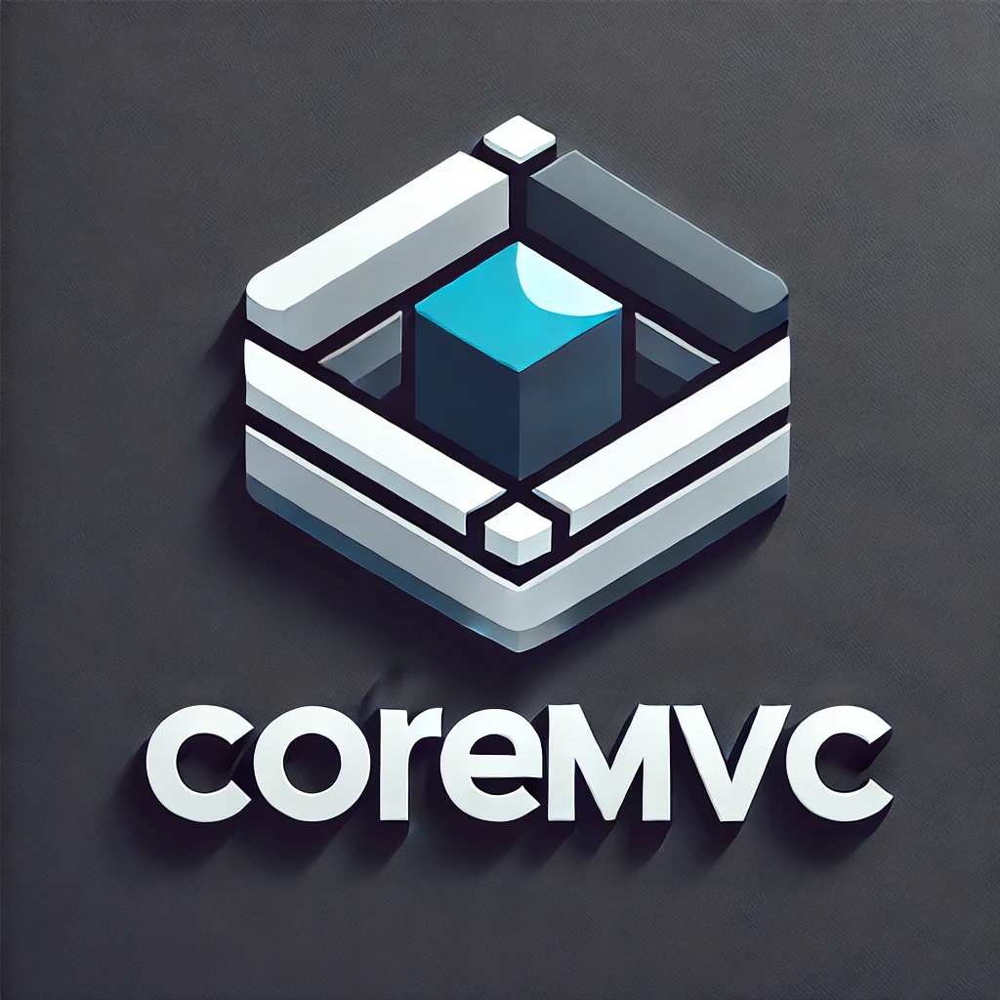

# CoreMVC



Ce projet est un modèle de base pour une architecture MVC (Modèle-Vue-Contrôleur) en PHP, conçu pour être simple, léger et facile à personnaliser. Il inclut un routeur, une structure de contrôleur et de modèle, ainsi qu'un système de vue pour afficher les données. Ce template peut être utilisé comme point de départ pour construire des applications PHP avec la structure MVC.

## Structure du projet

Voici un aperçu de la structure du répertoire du projet :

```
/my-mvc-app
    /app
        /controllers
            HomeController.php      # Contrôleur de la page d'accueil
        /models
            User.php                # Exemple de modèle
        /views
            /core
                head.php            # Vue de base pour <head>
                end.php             # Vue de base de cloture </html>
            /layout
                header.php          # Entête du site
                footer.php          # Pied de page
            home.php                # Vue de l'accueil
        /core
            Router.php              # Classe de routage
            Controller.php          # Classe de base pour les contrôleurs
            Model.php               # Classe de base pour les modèles
    /config
        config.php                  # Configuration de l'application
        routes.json                 # Configurations des routes
    /public
        /assets
            /images
            /movies
            /sounds
        /css
            /frameworks
                /bootstrap
                /fontawesome
            normalize.css           # CSS de normalisation
            style.css               # Fuille de style du site
            zoning.css              # CSS de zoning pour le developpement
        /fonts
        /js
            /frameworks
                vue.js
            /libraries
                jquery.js
            app.js                  # Fichier JavaScript
        /scss
            _colors.scss
            _extends.scss
            _mixins.scss
            _typo.scss
            _variables.scss
            style.scss              # Fichier SCSS
        index.php                   # Point d'entrée de l'application
    /storage
        /logs                       # Dossier pour les logs
    .htaccess                       # Configuration Apache pour réécriture d'URL
```

## Prérequis

- PHP 7.4 ou supérieur
- Serveur web (Apache, Nginx, ou PHP intégré via la commande `php -S`)

## Installation

### 1. Cloner le projet

Vous pouvez cloner ce projet dans votre répertoire local :

```bash
git clone https://github.com/dlhoumaud/coremvc.git
```

### 2. Configurer le fichier de configuration

Le fichier de configuration `.env` doit être configuré avec les informations de connexion à la base de données.

```ini
DB_HOST=xxx.xxx.x.xxx
DB_PORT=3306
DB_CHARSET=utf8
DB_NAME=core_mvc
DB_USER=xxx
DB_PASS=xxx
APP_ENV=development
APP_DEBUG=true
```
#### Crypter le fichier `.env`

```bash
php bin/core.php -e .env -k your_secret_key
```

#### Décrypter le fichier `.env`

```bash
php bin/core.php -d .env -k your_secret_key
```

### 3. Lancer le serveur de développement

Vous pouvez lancer un serveur de développement PHP avec le fichier `http.php` inclus dans le projet :

```bash
php bin/core.php -s localhost:8000
```

Cela démarrera un serveur PHP intégré à l'adresse `http://localhost:8000`.

### 4. Accéder à l'application

Une fois le serveur lancé, ouvrez votre navigateur et accédez à :

```
http://localhost:8000
```

## Fonctionnalités principales

### 1. Architecture MVC

Le modèle, la vue et le contrôleur sont organisés comme suit :

- **Modèle (`app/models`)** : Contient la logique métier et la gestion des données.
- **Vue (`app/views`)** : Gère l'affichage des informations à l'utilisateur.
- **Contrôleur (`app/controllers`)** : Gère la logique de traitement et redirige l'utilisateur vers la vue appropriée.

### 2. Routeur

Le `Router.php` gère la correspondance des URL vers les contrôleurs et les actions. Par défaut, il a des routes pour l'accueil et la page "À propos".

Exemple de route dans `config/routes.json` :

```json
{
    "/": {
        "controller": "HomeController",
        "action": "index"
    },
    "/about": {
        "controller": "HomeController",
        "action": "about"
    }
}
```

### 3. Autoloader

Le fichier `Autoloader.php` permet de charger automatiquement les classes à la volée. Vous n'avez pas besoin d'inclure manuellement chaque fichier de classe.

### 4. Exemple de contrôleur

Un exemple de contrôleur `HomeController.php` qui gère les actions de la page d'accueil et de la page "À propos".

```php
class HomeController extends Controller
{
    public function index()
    {
        $data = ['title' => 'Bienvenue sur mon site'];
        $this->view('home', $data);
    }

    public function about()
    {
        $data = ['title' => 'À propos'];
        $this->view('about', $data);
    }
}
```

#### variables des vues `app/views/`

- `head_title` : Titre de la page
- `head_description` : Description de la page
- `head_keywords` : Mots-clés de la page
- `head_author` : Auteur de la page
- `head_viewport` : Vueport de la page
- `main_attributes` : Attributs HTML pour la balise `<main>`
- `vue_datas` : Données à passer à Vue.js
- `vue_methods` : Methodes Vue.js à injecter dans les vues
- `vue_components` : Composants Vue.js à injecter dans les vues


### 5. Exemple de modèle

Un modèle simple `User.php` qui pourrait être utilisé pour interagir avec la base de données.

```php
class User extends Model
{
    public function getAllUsers()
    {
        $db = $this->dbConnect();
        $query = $db->query("SELECT * FROM users");
        return $query->fetchAll(PDO::FETCH_ASSOC);
    }
}
```

### 6. Exemple de vue

Une vue simple `home.php` qui est affichée lors de l'accès à la page d'accueil.

```php
    <h1>Bienvenue sur la page d'accueil</h1>
    <p><?= $title ?></p>
```

## Fichier `.htaccess`

Le fichier `.htaccess` est configuré pour réécrire les URL et rediriger toutes les requêtes vers `index.php`.

```apache
RewriteEngine On
RewriteCond %{REQUEST_FILENAME} !-f
RewriteCond %{REQUEST_FILENAME} !-d
RewriteRule ^(.+)$ /public/index.php [QSA,L]
```

## Compilation du style SCSS

Une fois Node.js et npm installés, vous pouvez installer Sass. Le paquet que vous allez utiliser s'appelle simplement `sass`.

```bash
npm install -g sass
```

vous pouvez le compiler en `style.css` avec la commande suivante :

```bash
sass public/scss/style.scss public/css/style.css
```

```bash
sass --watch public/scss/style.scss:public/css/style.css
```

Cette commande surveillera le fichier `style.scss` et le recompiler automatiquement en `style.css` à chaque modification.

Vous pouvez également surveiller un dossier entier :

```bash
sass --watch public/scss/:public/css/
```

```bash
sass public/scss/style.scss public/css/style.min.css --style compressed
```

Cela créera un fichier `style.min.css` minifié, optimisé pour une utilisation en production.

## Contribution

Si vous souhaitez contribuer à ce projet, vous pouvez suivre ces étapes :

1. Forkez le projet.
2. Créez une branche pour votre fonctionnalité (`git checkout -b feature/ma-fonctionnalite`).
3. Committez vos modifications (`git commit -am 'Ajout d'une nouvelle fonctionnalité'`).
4. Poussez sur votre branche (`git push origin feature/ma-fonctionnalite`).
5. Ouvrez une Pull Request.

## Licence

Ce projet est sous licence GNU GPL V3 - voir le fichier [LICENSE](https://www.gnu.org/licenses/) pour plus de détails.